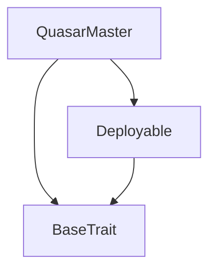
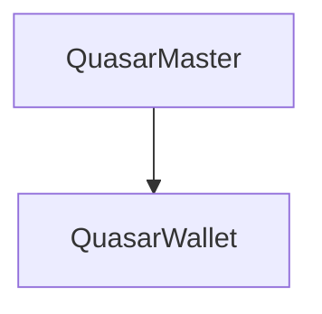

# Tact compilation report
Contract: QuasarMaster
BoC Size: 53521 bytes

## Structures (Structs and Messages)
Total structures: 84

### DataSize
TL-B: `_ cells:int257 bits:int257 refs:int257 = DataSize`
Signature: `DataSize{cells:int257,bits:int257,refs:int257}`

### SignedBundle
TL-B: `_ signature:fixed_bytes64 signedData:remainder<slice> = SignedBundle`
Signature: `SignedBundle{signature:fixed_bytes64,signedData:remainder<slice>}`

### StateInit
TL-B: `_ code:^cell data:^cell = StateInit`
Signature: `StateInit{code:^cell,data:^cell}`

### Context
TL-B: `_ bounceable:bool sender:address value:int257 raw:^slice = Context`
Signature: `Context{bounceable:bool,sender:address,value:int257,raw:^slice}`

### SendParameters
TL-B: `_ mode:int257 body:Maybe ^cell code:Maybe ^cell data:Maybe ^cell value:int257 to:address bounce:bool = SendParameters`
Signature: `SendParameters{mode:int257,body:Maybe ^cell,code:Maybe ^cell,data:Maybe ^cell,value:int257,to:address,bounce:bool}`

### MessageParameters
TL-B: `_ mode:int257 body:Maybe ^cell value:int257 to:address bounce:bool = MessageParameters`
Signature: `MessageParameters{mode:int257,body:Maybe ^cell,value:int257,to:address,bounce:bool}`

### DeployParameters
TL-B: `_ mode:int257 body:Maybe ^cell value:int257 bounce:bool init:StateInit{code:^cell,data:^cell} = DeployParameters`
Signature: `DeployParameters{mode:int257,body:Maybe ^cell,value:int257,bounce:bool,init:StateInit{code:^cell,data:^cell}}`

### StdAddress
TL-B: `_ workchain:int8 address:uint256 = StdAddress`
Signature: `StdAddress{workchain:int8,address:uint256}`

### VarAddress
TL-B: `_ workchain:int32 address:^slice = VarAddress`
Signature: `VarAddress{workchain:int32,address:^slice}`

### BasechainAddress
TL-B: `_ hash:Maybe int257 = BasechainAddress`
Signature: `BasechainAddress{hash:Maybe int257}`

### Deploy
TL-B: `deploy#946a98b6 queryId:uint64 = Deploy`
Signature: `Deploy{queryId:uint64}`

### DeployOk
TL-B: `deploy_ok#aff90f57 queryId:uint64 = DeployOk`
Signature: `DeployOk{queryId:uint64}`

### FactoryDeploy
TL-B: `factory_deploy#6d0ff13b queryId:uint64 cashback:address = FactoryDeploy`
Signature: `FactoryDeploy{queryId:uint64,cashback:address}`

### EventMint
TL-B: `event_mint#3345ab92 amount:int257 receiver:address = EventMint`
Signature: `EventMint{amount:int257,receiver:address}`

### EventBurn
TL-B: `event_burn#d28b2faf amount:int257 burner:address = EventBurn`
Signature: `EventBurn{amount:int257,burner:address}`

### EventFeeDistributed
TL-B: `event_fee_distributed#c47b9730 totalFee:int257 burn:int257 buyback:int257 lottery:int257 staking:int257 referral:int257 treasury:int257 defiPool:int257 = EventFeeDistributed`
Signature: `EventFeeDistributed{totalFee:int257,burn:int257,buyback:int257,lottery:int257,staking:int257,referral:int257,treasury:int257,defiPool:int257}`

### EventBuybackExecuted
TL-B: `event_buyback_executed#70acb7bb tonSpent:int257 qsrBurned:int257 = EventBuybackExecuted`
Signature: `EventBuybackExecuted{tonSpent:int257,qsrBurned:int257}`

### EventLotteryDrawn
TL-B: `event_lottery_drawn#56bbaafa round:int257 winner:address jackpot:int257 = EventLotteryDrawn`
Signature: `EventLotteryDrawn{round:int257,winner:address,jackpot:int257}`

### EventStake
TL-B: `event_stake#acd731a7 staker:address amount:int257 = EventStake`
Signature: `EventStake{staker:address,amount:int257}`

### EventUnstake
TL-B: `event_unstake#8445bc05 staker:address amount:int257 = EventUnstake`
Signature: `EventUnstake{staker:address,amount:int257}`

### EventReferralRegistered
TL-B: `event_referral_registered#28db358b user:address referrer:address = EventReferralRegistered`
Signature: `EventReferralRegistered{user:address,referrer:address}`

### EventVestingClaimed
TL-B: `event_vesting_claimed#3764fe76 beneficiary:address amount:int257 = EventVestingClaimed`
Signature: `EventVestingClaimed{beneficiary:address,amount:int257}`

### EventAiAction
TL-B: `event_ai_action#5e39a231 actionId:int257 actionType:^string oldValue:int257 newValue:int257 = EventAiAction`
Signature: `EventAiAction{actionId:int257,actionType:^string,oldValue:int257,newValue:int257}`

### AISetOracle
TL-B: `ai_set_oracle#2a297933 oracleAddress:address = AISetOracle`
Signature: `AISetOracle{oracleAddress:address}`

### AIGrantFullAutonomy
TL-B: `ai_grant_full_autonomy#c61e9667 enabled:bool = AIGrantFullAutonomy`
Signature: `AIGrantFullAutonomy{enabled:bool}`

### AIHeartbeat
TL-B: `ai_heartbeat#8f9872bd queryId:uint64 status:^string = AIHeartbeat`
Signature: `AIHeartbeat{queryId:uint64,status:^string}`

### AIVetoVote
TL-B: `ai_veto_vote#9d3b8cb1 actionId:uint64 voter:address stake:coins reason:^string = AIVetoVote`
Signature: `AIVetoVote{actionId:uint64,voter:address,stake:coins,reason:^string}`

### OwnerOverride
TL-B: `owner_override#09d21b11 actionId:uint64 reason:^string = OwnerOverride`
Signature: `OwnerOverride{actionId:uint64,reason:^string}`

### AIRebalance
TL-B: `ai_rebalance#2882f1e8 queryId:uint64 targetFeeBps:uint16 targetBurnShare:uint8 recommendation:^string = AIRebalance`
Signature: `AIRebalance{queryId:uint64,targetFeeBps:uint16,targetBurnShare:uint8,recommendation:^string}`

### AIPriceSignal
TL-B: `ai_price_signal#6920939f queryId:uint64 priceTon:coins volatility:uint32 sentiment:int8 action:uint8 = AIPriceSignal`
Signature: `AIPriceSignal{queryId:uint64,priceTon:coins,volatility:uint32,sentiment:int8,action:uint8}`

### AIAnomalyAlert
TL-B: `ai_anomaly_alert#dc63850b queryId:uint64 severity:uint8 anomalyType:uint8 affectedWallets:uint32 recommendedAction:^string = AIAnomalyAlert`
Signature: `AIAnomalyAlert{queryId:uint64,severity:uint8,anomalyType:uint8,affectedWallets:uint32,recommendedAction:^string}`

### AIGovernanceProposal
TL-B: `ai_governance_proposal#d890b03f queryId:uint64 proposalType:uint8 newValue:int257 description:^string confidence:uint8 = AIGovernanceProposal`
Signature: `AIGovernanceProposal{queryId:uint64,proposalType:uint8,newValue:int257,description:^string,confidence:uint8}`

### AISetFee
TL-B: `ai_set_fee#17df7398 queryId:uint64 feeBps:uint16 reason:^string = AISetFee`
Signature: `AISetFee{queryId:uint64,feeBps:uint16,reason:^string}`

### AISetTreasuryDirect
TL-B: `ai_set_treasury_direct#79b9e4c3 queryId:uint64 treasury:address reason:^string = AISetTreasuryDirect`
Signature: `AISetTreasuryDirect{queryId:uint64,treasury:address,reason:^string}`

### AISetAntiWhale
TL-B: `ai_set_anti_whale#10f7c0f7 queryId:uint64 maxTxBps:uint16 maxWalletBps:uint16 cooldown:uint16 reason:^string = AISetAntiWhale`
Signature: `AISetAntiWhale{queryId:uint64,maxTxBps:uint16,maxWalletBps:uint16,cooldown:uint16,reason:^string}`

### AISetBuybackDirect
TL-B: `ai_set_buyback_direct#0952917d queryId:uint64 enabled:bool threshold:coins cooldown:uint32 burnPercent:uint8 reason:^string = AISetBuybackDirect`
Signature: `AISetBuybackDirect{queryId:uint64,enabled:bool,threshold:coins,cooldown:uint32,burnPercent:uint8,reason:^string}`

### AIToggleTrading
TL-B: `ai_toggle_trading#0490d605 queryId:uint64 enabled:bool reason:^string = AIToggleTrading`
Signature: `AIToggleTrading{queryId:uint64,enabled:bool,reason:^string}`

### AIEmergencyPause
TL-B: `ai_emergency_pause#f5708ab5 queryId:uint64 pause:bool severity:uint8 reason:^string = AIEmergencyPause`
Signature: `AIEmergencyPause{queryId:uint64,pause:bool,severity:uint8,reason:^string}`

### AIRotateOracle
TL-B: `ai_rotate_oracle#2fb11c16 queryId:uint64 newOracle:address reason:^string = AIRotateOracle`
Signature: `AIRotateOracle{queryId:uint64,newOracle:address,reason:^string}`

### Mint
TL-B: `mint#642b7d07 amount:coins receiver:address = Mint`
Signature: `Mint{amount:coins,receiver:address}`

### BurnNotification
TL-B: `burn_notification#7bdd97de queryId:uint64 amount:coins sender:address responseDestination:address = BurnNotification`
Signature: `BurnNotification{queryId:uint64,amount:coins,sender:address,responseDestination:address}`

### TokenTransfer
TL-B: `token_transfer#0f8a7ea5 queryId:uint64 amount:coins destination:address responseDestination:address customPayload:Maybe ^cell forwardTonAmount:coins forwardPayload:remainder<slice> = TokenTransfer`
Signature: `TokenTransfer{queryId:uint64,amount:coins,destination:address,responseDestination:address,customPayload:Maybe ^cell,forwardTonAmount:coins,forwardPayload:remainder<slice>}`

### TokenBurn
TL-B: `token_burn#595f07bc queryId:uint64 amount:coins responseDestination:address customPayload:Maybe ^cell = TokenBurn`
Signature: `TokenBurn{queryId:uint64,amount:coins,responseDestination:address,customPayload:Maybe ^cell}`

### TokenNotification
TL-B: `token_notification#7362d09c queryId:uint64 amount:coins from:address forwardPayload:remainder<slice> = TokenNotification`
Signature: `TokenNotification{queryId:uint64,amount:coins,from:address,forwardPayload:remainder<slice>}`

### InternalTransfer
TL-B: `internal_transfer#178d4519 queryId:uint64 amount:coins from:address responseDestination:address forwardTonAmount:coins forwardPayload:remainder<slice> = InternalTransfer`
Signature: `InternalTransfer{queryId:uint64,amount:coins,from:address,responseDestination:address,forwardTonAmount:coins,forwardPayload:remainder<slice>}`

### PoolPayout
TL-B: `pool_payout#51a5c3d1 queryId:uint64 amount:coins destination:address = PoolPayout`
Signature: `PoolPayout{queryId:uint64,amount:coins,destination:address}`

### DefiPayout
TL-B: `defi_payout#bb8d8491 queryId:uint64 amount:coins destination:address = DefiPayout`
Signature: `DefiPayout{queryId:uint64,amount:coins,destination:address}`

### FeeTransfer
TL-B: `fee_transfer#eb527edf queryId:uint64 amount:coins originalSender:address originalReceiver:address = FeeTransfer`
Signature: `FeeTransfer{queryId:uint64,amount:coins,originalSender:address,originalReceiver:address}`

### SetTreasury
TL-B: `set_treasury#cfc66cbd treasury:address = SetTreasury`
Signature: `SetTreasury{treasury:address}`

### SetFeeConfig
TL-B: `set_fee_config#3c134728 feeBps:uint16 burnShare:uint8 maxTxBps:uint16 maxWalletBps:uint16 cooldown:uint16 = SetFeeConfig`
Signature: `SetFeeConfig{feeBps:uint16,burnShare:uint8,maxTxBps:uint16,maxWalletBps:uint16,cooldown:uint16}`

### ToggleTrading
TL-B: `toggle_trading#f1822da1 enabled:bool = ToggleTrading`
Signature: `ToggleTrading{enabled:bool}`

### TriggerBuyback
TL-B: `trigger_buyback#cfe1fd3c queryId:uint64 = TriggerBuyback`
Signature: `TriggerBuyback{queryId:uint64}`

### SetBuybackConfig
TL-B: `set_buyback_config#83b8144a enabled:bool threshold:coins cooldown:uint32 burnPercent:uint8 = SetBuybackConfig`
Signature: `SetBuybackConfig{enabled:bool,threshold:coins,cooldown:uint32,burnPercent:uint8}`

### SetDefiAddress
TL-B: `set_defi_address#23019716 defiAddress:address = SetDefiAddress`
Signature: `SetDefiAddress{defiAddress:address}`

### SyncFeeToDefi
TL-B: `sync_fee_to_defi#05a9795d amount:coins = SyncFeeToDefi`
Signature: `SyncFeeToDefi{amount:coins}`

### Stake
TL-B: `stake#bef0e904 amount:coins = Stake`
Signature: `Stake{amount:coins}`

### Unstake
TL-B: `unstake#ff633be1 amount:coins = Unstake`
Signature: `Unstake{amount:coins}`

### ClaimRewards
TL-B: `claim_rewards#094a1f7c  = ClaimRewards`
Signature: `ClaimRewards{}`

### SetStakingConfig
TL-B: `set_staking_config#13bd6b32 enabled:bool apyBps:uint16 minStake:coins lockPeriod:uint32 = SetStakingConfig`
Signature: `SetStakingConfig{enabled:bool,apyBps:uint16,minStake:coins,lockPeriod:uint32}`

### RegisterReferral
TL-B: `register_referral#d3b50b23 referrer:address = RegisterReferral`
Signature: `RegisterReferral{referrer:address}`

### ClaimReferralRewards
TL-B: `claim_referral_rewards#be1052b1  = ClaimReferralRewards`
Signature: `ClaimReferralRewards{}`

### SetReferralConfig
TL-B: `set_referral_config#1ab0a142 enabled:bool rewardBps:uint16 = SetReferralConfig`
Signature: `SetReferralConfig{enabled:bool,rewardBps:uint16}`

### AddVesting
TL-B: `add_vesting#ea3f3bdd beneficiary:address totalAmount:coins cliff:uint32 duration:uint32 = AddVesting`
Signature: `AddVesting{beneficiary:address,totalAmount:coins,cliff:uint32,duration:uint32}`

### ClaimVested
TL-B: `claim_vested#f789340a  = ClaimVested`
Signature: `ClaimVested{}`

### TriggerLottery
TL-B: `trigger_lottery#ab78b3cf queryId:uint64 = TriggerLottery`
Signature: `TriggerLottery{queryId:uint64}`

### SetLotteryConfig
TL-B: `set_lottery_config#1ba0fefa enabled:bool ticketPrice:coins drawInterval:uint32 jackpotShare:uint8 = SetLotteryConfig`
Signature: `SetLotteryConfig{enabled:bool,ticketPrice:coins,drawInterval:uint32,jackpotShare:uint8}`

### JettonData
TL-B: `_ totalSupply:int257 mintable:bool adminAddress:address jettonContent:^cell jettonWalletCode:^cell = JettonData`
Signature: `JettonData{totalSupply:int257,mintable:bool,adminAddress:address,jettonContent:^cell,jettonWalletCode:^cell}`

### JettonWalletData
TL-B: `_ balance:int257 owner:address master:address walletCode:^cell = JettonWalletData`
Signature: `JettonWalletData{balance:int257,owner:address,master:address,walletCode:^cell}`

### AIState
TL-B: `_ oracleAddress:address aiModeEnabled:bool fullAutonomy:bool lastRebalanceAt:int257 totalSignalsReceived:int257 currentFeeBps:int257 priceHistoryCount:int257 anomalyCount:int257 lastHeartbeat:int257 isAlive:bool = AIState`
Signature: `AIState{oracleAddress:address,aiModeEnabled:bool,fullAutonomy:bool,lastRebalanceAt:int257,totalSignalsReceived:int257,currentFeeBps:int257,priceHistoryCount:int257,anomalyCount:int257,lastHeartbeat:int257,isAlive:bool}`

### FeeConfig
TL-B: `_ feeBps:int257 burnShare:int257 treasuryShare:int257 maxTxBps:int257 maxWalletBps:int257 cooldown:int257 totalBurned:int257 totalFeesCollected:int257 = FeeConfig`
Signature: `FeeConfig{feeBps:int257,burnShare:int257,treasuryShare:int257,maxTxBps:int257,maxWalletBps:int257,cooldown:int257,totalBurned:int257,totalFeesCollected:int257}`

### BuybackState
TL-B: `_ enabled:bool pool:int257 threshold:int257 cooldown:int257 burnPercent:int257 lastBuybackAt:int257 totalBuybacks:int257 totalQsrBurnedViaBuyback:int257 totalTonSpent:int257 = BuybackState`
Signature: `BuybackState{enabled:bool,pool:int257,threshold:int257,cooldown:int257,burnPercent:int257,lastBuybackAt:int257,totalBuybacks:int257,totalQsrBurnedViaBuyback:int257,totalTonSpent:int257}`

### AutonomyState
TL-B: `_ fullAutonomyEnabled:bool aiActionCooldown:int257 lastAiActionTime:int257 heartbeatTimeout:int257 lastHeartbeat:int257 ownerOverrideWindow:int257 vetoThresholdBps:int257 totalVetoStake:int257 pendingActions:int257 = AutonomyState`
Signature: `AutonomyState{fullAutonomyEnabled:bool,aiActionCooldown:int257,lastAiActionTime:int257,heartbeatTimeout:int257,lastHeartbeat:int257,ownerOverrideWindow:int257,vetoThresholdBps:int257,totalVetoStake:int257,pendingActions:int257}`

### AIActionLog
TL-B: `_ actionId:int257 timestamp:int257 actionType:^string oldValue:int257 newValue:int257 reason:^string executed:bool vetoed:bool overridden:bool = AIActionLog`
Signature: `AIActionLog{actionId:int257,timestamp:int257,actionType:^string,oldValue:int257,newValue:int257,reason:^string,executed:bool,vetoed:bool,overridden:bool}`

### VetoState
TL-B: `_ actionId:int257 totalStake:int257 vetoCount:int257 threshold:int257 active:bool = VetoState`
Signature: `VetoState{actionId:int257,totalStake:int257,vetoCount:int257,threshold:int257,active:bool}`

### AIRecommendation
TL-B: `_ timestamp:int257 action:^string confidence:int257 executed:bool = AIRecommendation`
Signature: `AIRecommendation{timestamp:int257,action:^string,confidence:int257,executed:bool}`

### StakeInfo
TL-B: `_ amount:int257 startTime:int257 lastClaim:int257 lockEnd:int257 = StakeInfo`
Signature: `StakeInfo{amount:int257,startTime:int257,lastClaim:int257,lockEnd:int257}`

### StakingConfig
TL-B: `_ enabled:bool apyBps:int257 minStake:int257 lockPeriod:int257 totalStaked:int257 = StakingConfig`
Signature: `StakingConfig{enabled:bool,apyBps:int257,minStake:int257,lockPeriod:int257,totalStaked:int257}`

### ReferralInfo
TL-B: `_ referrer:address totalEarned:int257 totalReferrals:int257 = ReferralInfo`
Signature: `ReferralInfo{referrer:address,totalEarned:int257,totalReferrals:int257}`

### ReferralConfig
TL-B: `_ enabled:bool rewardBps:int257 = ReferralConfig`
Signature: `ReferralConfig{enabled:bool,rewardBps:int257}`

### VestingInfo
TL-B: `_ totalAmount:int257 claimed:int257 startTime:int257 cliff:int257 duration:int257 = VestingInfo`
Signature: `VestingInfo{totalAmount:int257,claimed:int257,startTime:int257,cliff:int257,duration:int257}`

### LotteryConfig
TL-B: `_ enabled:bool ticketPrice:int257 drawInterval:int257 jackpotShare:int257 currentRound:int257 lastDraw:int257 totalJackpot:int257 = LotteryConfig`
Signature: `LotteryConfig{enabled:bool,ticketPrice:int257,drawInterval:int257,jackpotShare:int257,currentRound:int257,lastDraw:int257,totalJackpot:int257}`

### LotteryTicket
TL-B: `_ round:int257 owner:address = LotteryTicket`
Signature: `LotteryTicket{round:int257,owner:address}`

### QuasarMaster$Data
TL-B: `_ totalSupply:coins maxSupply:coins mintable:bool owner:address content:^cell walletCode:^cell reserveBalance:coins custodyBalance:coins feeBps:uint16 feeBurnShare:uint8 treasury:address totalBurned:coins totalFeesCollected:coins maxTxBps:uint16 maxWalletBps:uint16 cooldownSeconds:uint16 tradingEnabled:bool buybackEnabled:bool buybackPool:coins buybackThreshold:coins buybackCooldown:uint32 buybackBurnPercent:uint8 lastBuybackTime:int257 totalBuybacks:int257 totalQsrBurnedViaBuyback:coins totalTonSpentOnBuyback:coins aiOracle:address aiEnabled:bool aiFullAutonomy:bool lastRebalanceTime:int257 signalCount:int257 priceHistory:dict<int, int> anomalyLog:dict<int, ^AIRecommendation{timestamp:int257,action:^string,confidence:int257,executed:bool}> anomalyIndex:int257 minConfidence:uint8 emergencyPause:bool aiActionCooldown:uint32 lastAiActionTime:int257 heartbeatTimeout:uint32 lastHeartbeat:int257 ownerOverrideWindow:uint32 vetoThresholdBps:uint16 aiActionLog:dict<int, ^AIActionLog{actionId:int257,timestamp:int257,actionType:^string,oldValue:int257,newValue:int257,reason:^string,executed:bool,vetoed:bool,overridden:bool}> aiActionIndex:int257 pendingAiActions:dict<int, int> vetoLog:dict<int, ^VetoState{actionId:int257,totalStake:int257,vetoCount:int257,threshold:int257,active:bool}> totalVetoStake:coins stakingEnabled:bool stakingApyBps:uint16 stakingMinStake:coins stakingLockPeriod:uint32 stakers:dict<address, ^StakeInfo{amount:int257,startTime:int257,lastClaim:int257,lockEnd:int257}> totalStaked:coins stakingRewardsPool:coins pendingQsrDeposits:dict<address, int> referralEnabled:bool referralRewardBps:uint16 referrals:dict<address, ^ReferralInfo{referrer:address,totalEarned:int257,totalReferrals:int257}> pendingReferralRewards:dict<address, int> vestingEnabled:bool teamAllocation:coins teamClaimed:coins vestingSchedules:dict<address, ^VestingInfo{totalAmount:int257,claimed:int257,startTime:int257,cliff:int257,duration:int257}> lotteryEnabled:bool lotteryTicketPrice:coins lotteryDrawInterval:uint32 lotteryJackpotShare:uint8 lotteryRound:int257 lotteryLastDraw:int257 lotteryJackpot:coins lotteryTickets:dict<int, address> lotteryTicketCount:int257 lotteryWinners:dict<int, address> defiAddress:address defiFeeShareBps:uint16 = QuasarMaster`
Signature: `QuasarMaster{totalSupply:coins,maxSupply:coins,mintable:bool,owner:address,content:^cell,walletCode:^cell,reserveBalance:coins,custodyBalance:coins,feeBps:uint16,feeBurnShare:uint8,treasury:address,totalBurned:coins,totalFeesCollected:coins,maxTxBps:uint16,maxWalletBps:uint16,cooldownSeconds:uint16,tradingEnabled:bool,buybackEnabled:bool,buybackPool:coins,buybackThreshold:coins,buybackCooldown:uint32,buybackBurnPercent:uint8,lastBuybackTime:int257,totalBuybacks:int257,totalQsrBurnedViaBuyback:coins,totalTonSpentOnBuyback:coins,aiOracle:address,aiEnabled:bool,aiFullAutonomy:bool,lastRebalanceTime:int257,signalCount:int257,priceHistory:dict<int, int>,anomalyLog:dict<int, ^AIRecommendation{timestamp:int257,action:^string,confidence:int257,executed:bool}>,anomalyIndex:int257,minConfidence:uint8,emergencyPause:bool,aiActionCooldown:uint32,lastAiActionTime:int257,heartbeatTimeout:uint32,lastHeartbeat:int257,ownerOverrideWindow:uint32,vetoThresholdBps:uint16,aiActionLog:dict<int, ^AIActionLog{actionId:int257,timestamp:int257,actionType:^string,oldValue:int257,newValue:int257,reason:^string,executed:bool,vetoed:bool,overridden:bool}>,aiActionIndex:int257,pendingAiActions:dict<int, int>,vetoLog:dict<int, ^VetoState{actionId:int257,totalStake:int257,vetoCount:int257,threshold:int257,active:bool}>,totalVetoStake:coins,stakingEnabled:bool,stakingApyBps:uint16,stakingMinStake:coins,stakingLockPeriod:uint32,stakers:dict<address, ^StakeInfo{amount:int257,startTime:int257,lastClaim:int257,lockEnd:int257}>,totalStaked:coins,stakingRewardsPool:coins,pendingQsrDeposits:dict<address, int>,referralEnabled:bool,referralRewardBps:uint16,referrals:dict<address, ^ReferralInfo{referrer:address,totalEarned:int257,totalReferrals:int257}>,pendingReferralRewards:dict<address, int>,vestingEnabled:bool,teamAllocation:coins,teamClaimed:coins,vestingSchedules:dict<address, ^VestingInfo{totalAmount:int257,claimed:int257,startTime:int257,cliff:int257,duration:int257}>,lotteryEnabled:bool,lotteryTicketPrice:coins,lotteryDrawInterval:uint32,lotteryJackpotShare:uint8,lotteryRound:int257,lotteryLastDraw:int257,lotteryJackpot:coins,lotteryTickets:dict<int, address>,lotteryTicketCount:int257,lotteryWinners:dict<int, address>,defiAddress:address,defiFeeShareBps:uint16}`

### QuasarWallet$Data
TL-B: `_ balance:coins owner:address master:address lastTxTime:int257 = QuasarWallet`
Signature: `QuasarWallet{balance:coins,owner:address,master:address,lastTxTime:int257}`

## Get methods
Total get methods: 27

## get_jetton_data
No arguments

## get_max_supply
No arguments

## get_reserve_balance
No arguments

## get_custody_balance
No arguments

## get_wallet_address
Argument: owner

## get_ai_state
No arguments

## get_autonomy_state
No arguments

## get_fee_config
No arguments

## get_buyback_state
No arguments

## get_staking_config
No arguments

## get_stake_info
Argument: staker

## get_pending_qsr_deposit
Argument: depositor

## get_referral_info
Argument: user

## get_pending_referral_reward
Argument: user

## get_vesting_info
Argument: beneficiary

## get_lottery_config
No arguments

## get_lottery_winner
Argument: round

## get_ai_action
Argument: actionId

## get_veto_state
Argument: actionId

## get_ai_recommendation
Argument: index

## get_price_at
Argument: timestamp

## is_paused
No arguments

## is_trading_enabled
No arguments

## is_ai_alive
No arguments

## can_owner_override
Argument: actionId

## get_defi_address
No arguments

## get_defi_fee_share
No arguments

## Exit codes
* 2: Stack underflow
* 3: Stack overflow
* 4: Integer overflow
* 5: Integer out of expected range
* 6: Invalid opcode
* 7: Type check error
* 8: Cell overflow
* 9: Cell underflow
* 10: Dictionary error
* 11: 'Unknown' error
* 12: Fatal error
* 13: Out of gas error
* 14: Virtualization error
* 32: Action list is invalid
* 33: Action list is too long
* 34: Action is invalid or not supported
* 35: Invalid source address in outbound message
* 36: Invalid destination address in outbound message
* 37: Not enough Toncoin
* 38: Not enough extra currencies
* 39: Outbound message does not fit into a cell after rewriting
* 40: Cannot process a message
* 41: Library reference is null
* 42: Library change action error
* 43: Exceeded maximum number of cells in the library or the maximum depth of the Merkle tree
* 50: Account state size exceeded limits
* 128: Null reference exception
* 129: Invalid serialization prefix
* 130: Invalid incoming message
* 131: Constraints error
* 132: Access denied
* 133: Contract stopped
* 134: Invalid argument
* 135: Code of a contract was not found
* 136: Invalid standard address
* 138: Not a basechain address
* 1228: Invalid oracle
* 1425: No tickets
* 2338: Invalid destination
* 2526: Only AI
* 4173: Self referral
* 6278: Closed
* 8012: Only implemented limits are allowed
* 8660: Insufficient
* 8916: Window closed
* 9291: Invalid treasury
* 10363: Unauthorized burn
* 11836: Invalid fee source
* 12241: Max supply exceeded
* 12449: Veto voting disabled until stake escrow is implemented
* 12493: Invalid token wallet
* 12724: Invalid burn share
* 13478: Minting off
* 14534: Not owner
* 15353: Insufficient custody balance
* 17062: Invalid amount
* 19280: Invalid buyback config
* 20145: Deposit QSR first
* 20944: AI disabled
* 21101: Already registered
* 21245: Insufficient stake
* 21516: Invalid receiver
* 22981: Done
* 25219: Lock active
* 25390: Buyback off
* 25534: Not found
* 25709: AI controls
* 26156: Below min
* 26868: AI alive
* 26908: Transfer limits are fixed
* 28115: No stake
* 28704: Wallet fee is fixed at 30 bps
* 30245: No vesting
* 31786: Pool low
* 33624: Invalid DeFi address
* 35499: Only owner
* 36222: Invalid lottery config
* 36553: DeFi not configured
* 39587: No referral rewards
* 40072: Pool empty
* 40265: Invalid transfer amount
* 40326: Supply underflow
* 40372: Max tx exceeded
* 41094: Already exists
* 42340: Too early
* 43719: Staking off
* 44027: Referral off
* 44695: Disable autonomy first
* 44799: Nothing to claim
* 45296: Invalid vesting
* 45605: Lottery off
* 46710: Amount too small
* 47767: Invalid referral reward
* 49729: Unauthorized
* 50562: Invalid buyback threshold
* 52432: Only AI oracle
* 52497: Cliff not reached
* 53010: No autonomy
* 53536: Low confidence
* 55849: Cooldown
* 56635: Only DeFi
* 57292: Trading off
* 57316: AI cooldown
* 57665: Invalid staking config
* 57732: Insufficient QSR reserve
* 57784: No rewards
* 57871: Invalid
* 59457: Paused
* 60911: Invalid DeFi transfer amount
* 61977: Range
* 63705: Unsupported governance proposal
* 63922: Invalid custody transfer amount

## Trait inheritance diagram

## Contract dependency diagram

