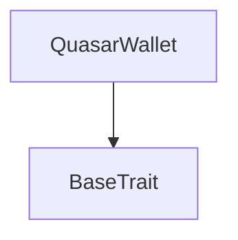
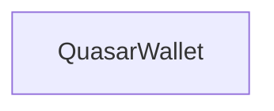

# TACT Compilation Report
Contract: QuasarWallet
BOC Size: 1479 bytes

# Types
Total Types: 64

## StateInit
TLB: `_ code:^cell data:^cell = StateInit`
Signature: `StateInit{code:^cell,data:^cell}`

## StdAddress
TLB: `_ workchain:int8 address:uint256 = StdAddress`
Signature: `StdAddress{workchain:int8,address:uint256}`

## VarAddress
TLB: `_ workchain:int32 address:^slice = VarAddress`
Signature: `VarAddress{workchain:int32,address:^slice}`

## Context
TLB: `_ bounced:bool sender:address value:int257 raw:^slice = Context`
Signature: `Context{bounced:bool,sender:address,value:int257,raw:^slice}`

## SendParameters
TLB: `_ bounce:bool to:address value:int257 mode:int257 body:Maybe ^cell code:Maybe ^cell data:Maybe ^cell = SendParameters`
Signature: `SendParameters{bounce:bool,to:address,value:int257,mode:int257,body:Maybe ^cell,code:Maybe ^cell,data:Maybe ^cell}`

## Deploy
TLB: `deploy#946a98b6 queryId:uint64 = Deploy`
Signature: `Deploy{queryId:uint64}`

## DeployOk
TLB: `deploy_ok#aff90f57 queryId:uint64 = DeployOk`
Signature: `DeployOk{queryId:uint64}`

## FactoryDeploy
TLB: `factory_deploy#6d0ff13b queryId:uint64 cashback:address = FactoryDeploy`
Signature: `FactoryDeploy{queryId:uint64,cashback:address}`

## AISetOracle
TLB: `ai_set_oracle#2a297933 oracleAddress:address = AISetOracle`
Signature: `AISetOracle{oracleAddress:address}`

## AIGrantFullAutonomy
TLB: `ai_grant_full_autonomy#c61e9667 enabled:bool = AIGrantFullAutonomy`
Signature: `AIGrantFullAutonomy{enabled:bool}`

## AIHeartbeat
TLB: `ai_heartbeat#8f9872bd queryId:uint64 status:^string = AIHeartbeat`
Signature: `AIHeartbeat{queryId:uint64,status:^string}`

## AIVetoVote
TLB: `ai_veto_vote#9d3b8cb1 actionId:uint64 voter:address stake:coins reason:^string = AIVetoVote`
Signature: `AIVetoVote{actionId:uint64,voter:address,stake:coins,reason:^string}`

## OwnerOverride
TLB: `owner_override#09d21b11 actionId:uint64 reason:^string = OwnerOverride`
Signature: `OwnerOverride{actionId:uint64,reason:^string}`

## AIRebalance
TLB: `ai_rebalance#2882f1e8 queryId:uint64 targetFeeBps:uint16 targetBurnShare:uint8 recommendation:^string = AIRebalance`
Signature: `AIRebalance{queryId:uint64,targetFeeBps:uint16,targetBurnShare:uint8,recommendation:^string}`

## AIPriceSignal
TLB: `ai_price_signal#6920939f queryId:uint64 priceTon:coins volatility:uint32 sentiment:int8 action:uint8 = AIPriceSignal`
Signature: `AIPriceSignal{queryId:uint64,priceTon:coins,volatility:uint32,sentiment:int8,action:uint8}`

## AIAnomalyAlert
TLB: `ai_anomaly_alert#dc63850b queryId:uint64 severity:uint8 anomalyType:uint8 affectedWallets:uint32 recommendedAction:^string = AIAnomalyAlert`
Signature: `AIAnomalyAlert{queryId:uint64,severity:uint8,anomalyType:uint8,affectedWallets:uint32,recommendedAction:^string}`

## AIGovernanceProposal
TLB: `ai_governance_proposal#d890b03f queryId:uint64 proposalType:uint8 newValue:int257 description:^string confidence:uint8 = AIGovernanceProposal`
Signature: `AIGovernanceProposal{queryId:uint64,proposalType:uint8,newValue:int257,description:^string,confidence:uint8}`

## AISetFee
TLB: `ai_set_fee#17df7398 queryId:uint64 feeBps:uint16 reason:^string = AISetFee`
Signature: `AISetFee{queryId:uint64,feeBps:uint16,reason:^string}`

## AISetTreasuryDirect
TLB: `ai_set_treasury_direct#79b9e4c3 queryId:uint64 treasury:address reason:^string = AISetTreasuryDirect`
Signature: `AISetTreasuryDirect{queryId:uint64,treasury:address,reason:^string}`

## AISetAntiWhale
TLB: `ai_set_anti_whale#10f7c0f7 queryId:uint64 maxTxBps:uint16 maxWalletBps:uint16 cooldown:uint16 reason:^string = AISetAntiWhale`
Signature: `AISetAntiWhale{queryId:uint64,maxTxBps:uint16,maxWalletBps:uint16,cooldown:uint16,reason:^string}`

## AISetBuybackDirect
TLB: `ai_set_buyback_direct#0952917d queryId:uint64 enabled:bool threshold:coins cooldown:uint32 burnPercent:uint8 reason:^string = AISetBuybackDirect`
Signature: `AISetBuybackDirect{queryId:uint64,enabled:bool,threshold:coins,cooldown:uint32,burnPercent:uint8,reason:^string}`

## AIToggleTrading
TLB: `ai_toggle_trading#0490d605 queryId:uint64 enabled:bool reason:^string = AIToggleTrading`
Signature: `AIToggleTrading{queryId:uint64,enabled:bool,reason:^string}`

## AIEmergencyPause
TLB: `ai_emergency_pause#f5708ab5 queryId:uint64 pause:bool severity:uint8 reason:^string = AIEmergencyPause`
Signature: `AIEmergencyPause{queryId:uint64,pause:bool,severity:uint8,reason:^string}`

## AIRotateOracle
TLB: `ai_rotate_oracle#2fb11c16 queryId:uint64 newOracle:address reason:^string = AIRotateOracle`
Signature: `AIRotateOracle{queryId:uint64,newOracle:address,reason:^string}`

## Mint
TLB: `mint#fc708bd2 amount:int257 receiver:address = Mint`
Signature: `Mint{amount:int257,receiver:address}`

## BurnNotification
TLB: `burn_notification#db17f0ca queryId:uint64 amount:int257 sender:address responseDestination:address = BurnNotification`
Signature: `BurnNotification{queryId:uint64,amount:int257,sender:address,responseDestination:address}`

## TokenTransfer
TLB: `token_transfer#93abb53e queryId:uint64 amount:coins destination:address responseDestination:address customPayload:Maybe ^cell forwardTonAmount:coins forwardPayload:remainder<slice> = TokenTransfer`
Signature: `TokenTransfer{queryId:uint64,amount:coins,destination:address,responseDestination:address,customPayload:Maybe ^cell,forwardTonAmount:coins,forwardPayload:remainder<slice>}`

## TokenBurn
TLB: `token_burn#e7822413 queryId:uint64 amount:coins responseDestination:address customPayload:Maybe ^cell = TokenBurn`
Signature: `TokenBurn{queryId:uint64,amount:coins,responseDestination:address,customPayload:Maybe ^cell}`

## TokenNotification
TLB: `token_notification#04ad3783 queryId:uint64 amount:coins from:address forwardPayload:remainder<slice> = TokenNotification`
Signature: `TokenNotification{queryId:uint64,amount:coins,from:address,forwardPayload:remainder<slice>}`

## FeeTransfer
TLB: `fee_transfer#eb527edf queryId:uint64 amount:coins originalSender:address originalReceiver:address = FeeTransfer`
Signature: `FeeTransfer{queryId:uint64,amount:coins,originalSender:address,originalReceiver:address}`

## SetTreasury
TLB: `set_treasury#cfc66cbd treasury:address = SetTreasury`
Signature: `SetTreasury{treasury:address}`

## SetFeeConfig
TLB: `set_fee_config#3c134728 feeBps:uint16 burnShare:uint8 maxTxBps:uint16 maxWalletBps:uint16 cooldown:uint16 = SetFeeConfig`
Signature: `SetFeeConfig{feeBps:uint16,burnShare:uint8,maxTxBps:uint16,maxWalletBps:uint16,cooldown:uint16}`

## ToggleTrading
TLB: `toggle_trading#f1822da1 enabled:bool = ToggleTrading`
Signature: `ToggleTrading{enabled:bool}`

## TriggerBuyback
TLB: `trigger_buyback#cfe1fd3c queryId:uint64 = TriggerBuyback`
Signature: `TriggerBuyback{queryId:uint64}`

## SetBuybackConfig
TLB: `set_buyback_config#83b8144a enabled:bool threshold:coins cooldown:uint32 burnPercent:uint8 = SetBuybackConfig`
Signature: `SetBuybackConfig{enabled:bool,threshold:coins,cooldown:uint32,burnPercent:uint8}`

## Stake
TLB: `stake#bef0e904 amount:coins = Stake`
Signature: `Stake{amount:coins}`

## Unstake
TLB: `unstake#ff633be1 amount:coins = Unstake`
Signature: `Unstake{amount:coins}`

## ClaimRewards
TLB: `claim_rewards#094a1f7c  = ClaimRewards`
Signature: `ClaimRewards{}`

## SetStakingConfig
TLB: `set_staking_config#13bd6b32 enabled:bool apyBps:uint16 minStake:coins lockPeriod:uint32 = SetStakingConfig`
Signature: `SetStakingConfig{enabled:bool,apyBps:uint16,minStake:coins,lockPeriod:uint32}`

## RegisterReferral
TLB: `register_referral#d3b50b23 referrer:address = RegisterReferral`
Signature: `RegisterReferral{referrer:address}`

## ClaimReferralRewards
TLB: `claim_referral_rewards#be1052b1  = ClaimReferralRewards`
Signature: `ClaimReferralRewards{}`

## SetReferralConfig
TLB: `set_referral_config#1ab0a142 enabled:bool rewardBps:uint16 = SetReferralConfig`
Signature: `SetReferralConfig{enabled:bool,rewardBps:uint16}`

## AddVesting
TLB: `add_vesting#ea3f3bdd beneficiary:address totalAmount:coins cliff:uint32 duration:uint32 = AddVesting`
Signature: `AddVesting{beneficiary:address,totalAmount:coins,cliff:uint32,duration:uint32}`

## ClaimVested
TLB: `claim_vested#f789340a  = ClaimVested`
Signature: `ClaimVested{}`

## TriggerLottery
TLB: `trigger_lottery#ab78b3cf queryId:uint64 = TriggerLottery`
Signature: `TriggerLottery{queryId:uint64}`

## SetLotteryConfig
TLB: `set_lottery_config#1ba0fefa enabled:bool ticketPrice:coins drawInterval:uint32 jackpotShare:uint8 = SetLotteryConfig`
Signature: `SetLotteryConfig{enabled:bool,ticketPrice:coins,drawInterval:uint32,jackpotShare:uint8}`

## JettonData
TLB: `_ totalSupply:int257 mintable:bool adminAddress:address jettonContent:^cell jettonWalletCode:^cell = JettonData`
Signature: `JettonData{totalSupply:int257,mintable:bool,adminAddress:address,jettonContent:^cell,jettonWalletCode:^cell}`

## JettonWalletData
TLB: `_ balance:int257 owner:address master:address walletCode:^cell = JettonWalletData`
Signature: `JettonWalletData{balance:int257,owner:address,master:address,walletCode:^cell}`

## AIState
TLB: `_ oracleAddress:address aiModeEnabled:bool fullAutonomy:bool lastRebalanceAt:int257 totalSignalsReceived:int257 currentFeeBps:int257 priceHistoryCount:int257 anomalyCount:int257 lastHeartbeat:int257 isAlive:bool = AIState`
Signature: `AIState{oracleAddress:address,aiModeEnabled:bool,fullAutonomy:bool,lastRebalanceAt:int257,totalSignalsReceived:int257,currentFeeBps:int257,priceHistoryCount:int257,anomalyCount:int257,lastHeartbeat:int257,isAlive:bool}`

## FeeConfig
TLB: `_ feeBps:int257 burnShare:int257 treasuryShare:int257 maxTxBps:int257 maxWalletBps:int257 cooldown:int257 totalBurned:int257 totalFeesCollected:int257 = FeeConfig`
Signature: `FeeConfig{feeBps:int257,burnShare:int257,treasuryShare:int257,maxTxBps:int257,maxWalletBps:int257,cooldown:int257,totalBurned:int257,totalFeesCollected:int257}`

## BuybackState
TLB: `_ enabled:bool pool:int257 threshold:int257 cooldown:int257 burnPercent:int257 lastBuybackAt:int257 totalBuybacks:int257 totalQsrBurnedViaBuyback:int257 totalTonSpent:int257 = BuybackState`
Signature: `BuybackState{enabled:bool,pool:int257,threshold:int257,cooldown:int257,burnPercent:int257,lastBuybackAt:int257,totalBuybacks:int257,totalQsrBurnedViaBuyback:int257,totalTonSpent:int257}`

## AutonomyState
TLB: `_ fullAutonomyEnabled:bool aiActionCooldown:int257 lastAiActionTime:int257 heartbeatTimeout:int257 lastHeartbeat:int257 ownerOverrideWindow:int257 vetoThresholdBps:int257 totalVetoStake:int257 pendingActions:int257 = AutonomyState`
Signature: `AutonomyState{fullAutonomyEnabled:bool,aiActionCooldown:int257,lastAiActionTime:int257,heartbeatTimeout:int257,lastHeartbeat:int257,ownerOverrideWindow:int257,vetoThresholdBps:int257,totalVetoStake:int257,pendingActions:int257}`

## AIActionLog
TLB: `_ actionId:int257 timestamp:int257 actionType:^string oldValue:int257 newValue:int257 reason:^string executed:bool vetoed:bool overridden:bool = AIActionLog`
Signature: `AIActionLog{actionId:int257,timestamp:int257,actionType:^string,oldValue:int257,newValue:int257,reason:^string,executed:bool,vetoed:bool,overridden:bool}`

## VetoState
TLB: `_ actionId:int257 totalStake:int257 vetoCount:int257 threshold:int257 active:bool = VetoState`
Signature: `VetoState{actionId:int257,totalStake:int257,vetoCount:int257,threshold:int257,active:bool}`

## AIRecommendation
TLB: `_ timestamp:int257 action:^string confidence:int257 executed:bool = AIRecommendation`
Signature: `AIRecommendation{timestamp:int257,action:^string,confidence:int257,executed:bool}`

## StakeInfo
TLB: `_ amount:int257 startTime:int257 lastClaim:int257 lockEnd:int257 = StakeInfo`
Signature: `StakeInfo{amount:int257,startTime:int257,lastClaim:int257,lockEnd:int257}`

## StakingConfig
TLB: `_ enabled:bool apyBps:int257 minStake:int257 lockPeriod:int257 totalStaked:int257 = StakingConfig`
Signature: `StakingConfig{enabled:bool,apyBps:int257,minStake:int257,lockPeriod:int257,totalStaked:int257}`

## ReferralInfo
TLB: `_ referrer:address totalEarned:int257 totalReferrals:int257 = ReferralInfo`
Signature: `ReferralInfo{referrer:address,totalEarned:int257,totalReferrals:int257}`

## ReferralConfig
TLB: `_ enabled:bool rewardBps:int257 = ReferralConfig`
Signature: `ReferralConfig{enabled:bool,rewardBps:int257}`

## VestingInfo
TLB: `_ totalAmount:int257 claimed:int257 startTime:int257 cliff:int257 duration:int257 = VestingInfo`
Signature: `VestingInfo{totalAmount:int257,claimed:int257,startTime:int257,cliff:int257,duration:int257}`

## LotteryConfig
TLB: `_ enabled:bool ticketPrice:int257 drawInterval:int257 jackpotShare:int257 currentRound:int257 lastDraw:int257 totalJackpot:int257 = LotteryConfig`
Signature: `LotteryConfig{enabled:bool,ticketPrice:int257,drawInterval:int257,jackpotShare:int257,currentRound:int257,lastDraw:int257,totalJackpot:int257}`

## LotteryTicket
TLB: `_ round:int257 owner:address = LotteryTicket`
Signature: `LotteryTicket{round:int257,owner:address}`

## QuasarMaster$Data
TLB: `null`
Signature: `null`

## QuasarWallet$Data
TLB: `null`
Signature: `null`

# Get Methods
Total Get Methods: 1

## get_wallet_data

# Error Codes
2: Stack underflow
3: Stack overflow
4: Integer overflow
5: Integer out of expected range
6: Invalid opcode
7: Type check error
8: Cell overflow
9: Cell underflow
10: Dictionary error
11: 'Unknown' error
12: Fatal error
13: Out of gas error
14: Virtualization error
32: Action list is invalid
33: Action list is too long
34: Action is invalid or not supported
35: Invalid source address in outbound message
36: Invalid destination address in outbound message
37: Not enough TON
38: Not enough extra-currencies
39: Outbound message does not fit into a cell after rewriting
40: Cannot process a message
41: Library reference is null
42: Library change action error
43: Exceeded maximum number of cells in the library or the maximum depth of the Merkle tree
50: Account state size exceeded limits
128: Null reference exception
129: Invalid serialization prefix
130: Invalid incoming message
131: Constraints error
132: Access denied
133: Contract stopped
134: Invalid argument
135: Code of a contract was not found
136: Invalid address
137: Masterchain support is not enabled for this contract
1425: No tickets
2526: Only AI
4173: Self referral
6278: Closed
8660: Insufficient
8916: Window closed
10363: Unauthorized burn
11836: Invalid fee source
13478: Minting off
14534: Not owner
20944: AI disabled
21101: Already registered
21245: Insufficient stake
22981: Done
25219: Lock active
25390: Buyback off
25534: Not found
25709: AI controls
26156: Below min
26868: AI alive
28115: No stake
30245: No vesting
31786: Pool low
34524: Limits
35499: Only owner
38227: Fee 0.10%-1.00%
40072: Pool empty
40372: Max tx exceeded
41094: Already exists
42340: Too early
43719: Staking off
44027: Referral off
44695: Disable autonomy first
44799: Nothing to claim
45605: Lottery off
49729: Unauthorized
52432: Only AI oracle
52497: Cliff not reached
53010: No autonomy
53536: Low confidence
55849: Cooldown
57292: Trading off
57316: AI cooldown
57784: No rewards
57871: Invalid
59457: Paused
61977: Range

# Trait Inheritance Diagram

# Contract Dependency Diagram

