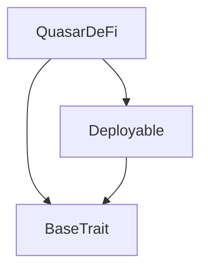
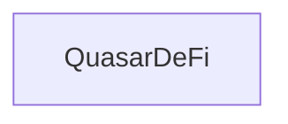

# Tact compilation report
Contract: QuasarDeFi
BoC Size: 5881 bytes

## Structures (Structs and Messages)
Total structures: 34

### DataSize
TL-B: `_ cells:int257 bits:int257 refs:int257 = DataSize`
Signature: `DataSize{cells:int257,bits:int257,refs:int257}`

### SignedBundle
TL-B: `_ signature:fixed_bytes64 signedData:remainder<slice> = SignedBundle`
Signature: `SignedBundle{signature:fixed_bytes64,signedData:remainder<slice>}`

### StateInit
TL-B: `_ code:^cell data:^cell = StateInit`
Signature: `StateInit{code:^cell,data:^cell}`

### Context
TL-B: `_ bounceable:bool sender:address value:int257 raw:^slice = Context`
Signature: `Context{bounceable:bool,sender:address,value:int257,raw:^slice}`

### SendParameters
TL-B: `_ mode:int257 body:Maybe ^cell code:Maybe ^cell data:Maybe ^cell value:int257 to:address bounce:bool = SendParameters`
Signature: `SendParameters{mode:int257,body:Maybe ^cell,code:Maybe ^cell,data:Maybe ^cell,value:int257,to:address,bounce:bool}`

### MessageParameters
TL-B: `_ mode:int257 body:Maybe ^cell value:int257 to:address bounce:bool = MessageParameters`
Signature: `MessageParameters{mode:int257,body:Maybe ^cell,value:int257,to:address,bounce:bool}`

### DeployParameters
TL-B: `_ mode:int257 body:Maybe ^cell value:int257 bounce:bool init:StateInit{code:^cell,data:^cell} = DeployParameters`
Signature: `DeployParameters{mode:int257,body:Maybe ^cell,value:int257,bounce:bool,init:StateInit{code:^cell,data:^cell}}`

### StdAddress
TL-B: `_ workchain:int8 address:uint256 = StdAddress`
Signature: `StdAddress{workchain:int8,address:uint256}`

### VarAddress
TL-B: `_ workchain:int32 address:^slice = VarAddress`
Signature: `VarAddress{workchain:int32,address:^slice}`

### BasechainAddress
TL-B: `_ hash:Maybe int257 = BasechainAddress`
Signature: `BasechainAddress{hash:Maybe int257}`

### Deploy
TL-B: `deploy#946a98b6 queryId:uint64 = Deploy`
Signature: `Deploy{queryId:uint64}`

### DeployOk
TL-B: `deploy_ok#aff90f57 queryId:uint64 = DeployOk`
Signature: `DeployOk{queryId:uint64}`

### FactoryDeploy
TL-B: `factory_deploy#6d0ff13b queryId:uint64 cashback:address = FactoryDeploy`
Signature: `FactoryDeploy{queryId:uint64,cashback:address}`

### AddLiquidity
TL-B: `add_liquidity#08bfa37d tonAmount:coins qsrAmount:coins = AddLiquidity`
Signature: `AddLiquidity{tonAmount:coins,qsrAmount:coins}`

### RemoveLiquidity
TL-B: `remove_liquidity#c3f44eb8 lpAmount:coins = RemoveLiquidity`
Signature: `RemoveLiquidity{lpAmount:coins}`

### SwapToTON
TL-B: `swap_to_ton#42a7c44c qsrAmount:coins minTonOut:coins = SwapToTON`
Signature: `SwapToTON{qsrAmount:coins,minTonOut:coins}`

### SwapToQSR
TL-B: `swap_to_qsr#b402f875 tonAmount:coins minQsrOut:coins = SwapToQSR`
Signature: `SwapToQSR{tonAmount:coins,minQsrOut:coins}`

### ClaimFarmRewards
TL-B: `claim_farm_rewards#511327f0  = ClaimFarmRewards`
Signature: `ClaimFarmRewards{}`

### SetFarmConfig
TL-B: `set_farm_config#e7ceed7e rewardPerSecond:coins startTime:uint32 endTime:uint32 = SetFarmConfig`
Signature: `SetFarmConfig{rewardPerSecond:coins,startTime:uint32,endTime:uint32}`

### SetFeeBps
TL-B: `set_fee_bps#17000fb2 feeBps:uint16 = SetFeeBps`
Signature: `SetFeeBps{feeBps:uint16}`

### SetPaused
TL-B: `set_paused#096819ff paused:bool = SetPaused`
Signature: `SetPaused{paused:bool}`

### SetMaxTradeBps
TL-B: `set_max_trade_bps#dcff684f maxTradeBps:uint16 = SetMaxTradeBps`
Signature: `SetMaxTradeBps{maxTradeBps:uint16}`

### DefiPayout
TL-B: `defi_payout#bb8d8491 queryId:uint64 amount:coins destination:address = DefiPayout`
Signature: `DefiPayout{queryId:uint64,amount:coins,destination:address}`

### TokenNotification
TL-B: `token_notification#04ad3783 queryId:uint64 amount:coins from:address forwardPayload:remainder<slice> = TokenNotification`
Signature: `TokenNotification{queryId:uint64,amount:coins,from:address,forwardPayload:remainder<slice>}`

### EventLiquidityAdded
TL-B: `event_liquidity_added#1323cbef provider:address tonAmount:int257 qsrAmount:int257 lpMinted:int257 = EventLiquidityAdded`
Signature: `EventLiquidityAdded{provider:address,tonAmount:int257,qsrAmount:int257,lpMinted:int257}`

### EventLiquidityRemoved
TL-B: `event_liquidity_removed#5b4f24a9 provider:address tonOut:int257 qsrOut:int257 lpBurned:int257 = EventLiquidityRemoved`
Signature: `EventLiquidityRemoved{provider:address,tonOut:int257,qsrOut:int257,lpBurned:int257}`

### EventSwap
TL-B: `event_swap#c02a5493 trader:address tonIn:int257 qsrIn:int257 tonOut:int257 qsrOut:int257 fee:int257 = EventSwap`
Signature: `EventSwap{trader:address,tonIn:int257,qsrIn:int257,tonOut:int257,qsrOut:int257,fee:int257}`

### EventFarmReward
TL-B: `event_farm_reward#ca3de6d5 farmer:address amount:int257 = EventFarmReward`
Signature: `EventFarmReward{farmer:address,amount:int257}`

### EventFeeCollected
TL-B: `event_fee_collected#60d4a4da amount:int257 = EventFeeCollected`
Signature: `EventFeeCollected{amount:int257}`

### LPInfo
TL-B: `_ totalSupply:int257 tonReserve:int257 qsrReserve:int257 = LPInfo`
Signature: `LPInfo{totalSupply:int257,tonReserve:int257,qsrReserve:int257}`

### FarmInfo
TL-B: `_ staked:int257 rewardPerSecond:int257 lastUpdate:int257 accRewardPerShare:int257 startTime:int257 endTime:int257 = FarmInfo`
Signature: `FarmInfo{staked:int257,rewardPerSecond:int257,lastUpdate:int257,accRewardPerShare:int257,startTime:int257,endTime:int257}`

### UserFarmInfo
TL-B: `_ staked:int257 debt:int257 pending:int257 = UserFarmInfo`
Signature: `UserFarmInfo{staked:int257,debt:int257,pending:int257}`

### SwapQuote
TL-B: `_ tonIn:int257 qsrIn:int257 tonOut:int257 qsrOut:int257 fee:int257 priceImpactBps:int257 = SwapQuote`
Signature: `SwapQuote{tonIn:int257,qsrIn:int257,tonOut:int257,qsrOut:int257,fee:int257,priceImpactBps:int257}`

### QuasarDeFi$Data
TL-B: `_ owner:address qsrMaster:address lpTotalSupply:coins tonReserve:coins qsrReserve:coins lpBalances:dict<address, int> pendingQsrDeposits:dict<address, int> feeBps:uint16 feeAccumulated:coins farmEnabled:bool farmRewardPerSecond:coins farmStartTime:uint32 farmEndTime:uint32 farmLastUpdate:int257 farmAccRewardPerShare:int257 farmTotalStaked:coins farmStakes:dict<address, ^UserFarmInfo{staked:int257,debt:int257,pending:int257}> locked:bool paused:bool maxTradeBps:uint16 = QuasarDeFi`
Signature: `QuasarDeFi{owner:address,qsrMaster:address,lpTotalSupply:coins,tonReserve:coins,qsrReserve:coins,lpBalances:dict<address, int>,pendingQsrDeposits:dict<address, int>,feeBps:uint16,feeAccumulated:coins,farmEnabled:bool,farmRewardPerSecond:coins,farmStartTime:uint32,farmEndTime:uint32,farmLastUpdate:int257,farmAccRewardPerShare:int257,farmTotalStaked:coins,farmStakes:dict<address, ^UserFarmInfo{staked:int257,debt:int257,pending:int257}>,locked:bool,paused:bool,maxTradeBps:uint16}`

## Get methods
Total get methods: 13

## lpBalance
Argument: user

## pendingQsrDeposit
Argument: user

## poolInfo
No arguments

## farmInfo
No arguments

## userFarm
Argument: user

## estimateSwapToTon
Argument: qsrAmount

## estimateSwapToQsr
Argument: tonAmount

## estimateLpOut
Argument: tonAmount
Argument: qsrAmount

## estimateRemoveLiquidity
Argument: lpAmount

## feeConfig
No arguments

## feeAccumulated
No arguments

## owner
No arguments

## qsrMaster
No arguments

## Exit codes
* 2: Stack underflow
* 3: Stack overflow
* 4: Integer overflow
* 5: Integer out of expected range
* 6: Invalid opcode
* 7: Type check error
* 8: Cell overflow
* 9: Cell underflow
* 10: Dictionary error
* 11: 'Unknown' error
* 12: Fatal error
* 13: Out of gas error
* 14: Virtualization error
* 32: Action list is invalid
* 33: Action list is too long
* 34: Action is invalid or not supported
* 35: Invalid source address in outbound message
* 36: Invalid destination address in outbound message
* 37: Not enough Toncoin
* 38: Not enough extra currencies
* 39: Outbound message does not fit into a cell after rewriting
* 40: Cannot process a message
* 41: Library reference is null
* 42: Library change action error
* 43: Exceeded maximum number of cells in the library or the maximum depth of the Merkle tree
* 50: Account state size exceeded limits
* 128: Null reference exception
* 129: Invalid serialization prefix
* 130: Invalid incoming message
* 131: Constraints error
* 132: Access denied
* 133: Contract stopped
* 134: Invalid argument
* 135: Code of a contract was not found
* 136: Invalid standard address
* 138: Not a basechain address
* 3561: TON deposit too large
* 5623: Invalid swap
* 12203: Invalid amounts
* 16323: Insufficient reserve
* 16729: No LP stake
* 17062: Invalid amount
* 19907: Trade limit 1%-50%
* 20145: Deposit QSR first
* 22606: Insufficient LP balance
* 24969: DeFi paused
* 27536: Only QSR master
* 27929: Trade too large
* 31600: Farm already ended
* 35499: Only owner
* 39600: Fee must be 0.01%-1%
* 40520: Invalid reward rate
* 41529: Slippage exceeded
* 42362: Reentrant call
* 43467: Zero output
* 48341: Insufficient TON sent
* 51358: Farm stake insufficient
* 52158: Invalid LP amount
* 52910: Invalid farm period
* 54751: QSR deposit too large
* 55678: Zero LP tokens
* 58957: Invalid depositor
* 63475: No rewards to claim

## Trait inheritance diagram

## Contract dependency diagram

